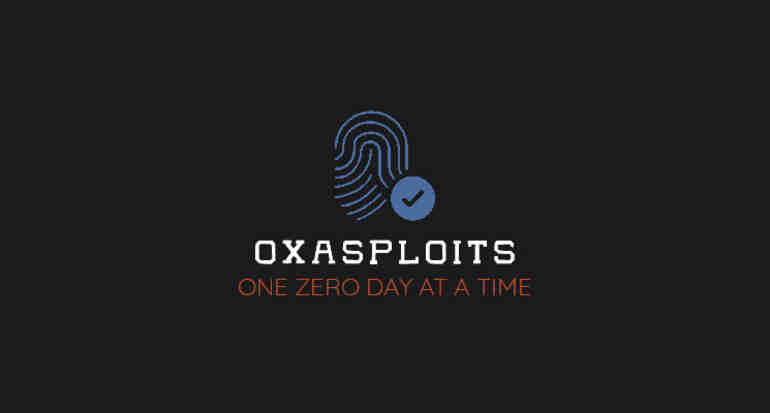

# oxasploits
## A number of exploits written by oxagast
Most of these CVEs are accreddited to oxagast as well

# CVEs and PoC code

## CVE-2006-3392
### Webmin <=1.29 remote root exploit
This exploit, lifts a Webmin cookie with a directory transversal and
aritrary read exploit, then reuses the cookie to use an authenticated
user exploit to get root remotely.

## CVE-2010-2626
### Perl pipe upload and shell for Miyabi CGI Tools <=1.02 and iOffice 0.1
This exploit uploads a perl program via buggy perl open reads (|).  After
pushing the program it chmods and spawns a shell.  Should work
regaurdless if the server is firewalled or not.

## CVE-2016-10401
### PK5001Z router remote root exploit
Uses known telnet user and root pass to log in as root.

## CVE-2018-17336
### UDisks <=2.8.0 DoS
This is example code that crashes udisks2 via malformed filesystem label
that when mounted then logged a string format vulnerability exists allowing
arbitrary read/write of memory as root.

## CVE-2019-12881
### Linux Kernel 4.15.x i915 driver NULL pointer dereference
This code demonstrates crafted ioctl calls to the i915 garphics
driver that allow overwrite of CR2 register in kernel space triggering
a NULL pointer dereference.

## CVE-2019-15947
### Bitcoin Core bitcoin-qt wallet.dat recoverable from .core dump
This exploit recovers wallet.dat's that were loaded at the time of a crash 
from bitcoin-qt .core crash dump files by grepping for a magic string at 
the beginning of the wallet, calculating the offset, then reconstructing 
the wallet.dat(s) with xxd.

## CVE-2017-5816
### HP iMC dbman.exe PLAT 7.3 command injection exploit
Incorrect santization of input leads to a remote code execution vulnerabilty 
within dbman.exe of the HP iMC PLAT 7.3 suite.  Code execs with SYSTEM privileges.

## CVE-2021-3560
### Polkit and dbus race conditon LPE exploit
A race condition exists in polkit where if you send dbus messages, then
kill the process midway through, incorrect permissions are set on users that were
never intended to be able to be created, with system priviledges.  This leads to
local root compromise.

## RougeTooth
### Abusing Bluetooth HCI_EVT and HID control codes on a Samsung Galaxy S8
If you can get an unsuspecting user to connect to an attacking machine, by
maquorading it as a speaker (or whatever), you can inject HID codes and take
control over the device, to the extent where you can blindly pop a shell if
termux is installed, al-la rubber-ducky style.  Working PoC and video included.

## WoahIsRead
### OpenSSH 9.2 SSHd banner symbolic link LPE
OpenSSHd 9.2 and below do not properly check permissions and ownership on files
used as banners.  If the banner is set to a user writeable file, this allows an
attacker to remove the file, create a symbolic link to any root-only readable file
on the system (like /etc/shadow for example), and it will be dumped on next
connection to the sshd daemon.  Successful login to sshd is not required for this
to work.

______________________________________________________________________________

# Tools

## ansvif
This is a fuzzer, written in C++, designed to find bugs in C/C++ programs.

##  MAPDAV
This is a tool for building wordlists out of things known about a user.

## all_suid.sh
This tool creates a list of all suid 0 executables from apt archives.

## autopreter.pl
A tool that builds metasploit resource scripts from nmap scans.
